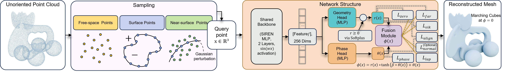

# Metric--Phase Fields: Decoupling Distance and Sign for Thin-Structure Reconstruction from Unoriented Point Clouds

> Official implementation of **Metric--Phase Fields (MPFs)**  
> Code release coming soon.


<p align="center">
  <video src="./assets/MPF.mp4" autoplay loop muted playsinline controls style="width: 100%; max-width: 800px; border-radius: 12px; box-shadow: 0 4px 20px rgba(0,0,0,0.15);"></video>
  <br>
  <em>Figure 1: Dynamic 3D visualization of our non-manifold reconstruction results.</em>
</p>

---

## Authors

Jiayi Kong<sup>1</sup>, 
Xuhui Chen<sup>2,3</sup>, 
Chen Zong<sup>4</sup>, 
Fei Hou<sup>2,3</sup>, 
Junhui Hou<sup>5</sup>, 
Wenping Wang<sup>6</sup>, 
Ying He<sup>1</sup>

<sup>1</sup> S-Lab, Nanyang Technological University, Singapore 
<sup>2</sup> Institute of Software, Chinese Academy of Sciences, China  
<sup>3</sup> University of Chinese Academy of Sciences, China  
<sup>4</sup> Nanjing University of Aeronautics and Astronautics, China  
<sup>5</sup> City University of Hong Kong, Hong Kong SAR, China  
<sup>6</sup> Texas A&M University, USA  

Corresponding author: Ying He (yhe@ntu.edu.sg)
For any questions regarding the paper, code, or datasets, please feel free to contact:
* **Kong Jiayi (Scarlett)**: [jiayi006@e.ntu.edu.sg](mailto:jiayi006@e.ntu.edu.sg)
---

## Abstract

Neural Signed Distance Functions (SDFs) excel at reconstructing watertight manifolds but fail on thin structures and open boundaries due to strict inside--outside constraints. Conversely, Unsigned Distance Fields (UDFs) accommodate general geometries but suffer from gradient singularities at the zero-level set, hindering optimization and extraction.
We introduce Metric–-Phase Fields (MPFs), a decoupled implicit representation that separates metric proximity from topological phase. Given an unoriented point cloud, MPFs learn (i) an unsigned metric field $r$ and (ii) a smooth phase field $\theta$, for which we derive a bounded phase indicator $P=\tanh(\beta\theta)$ that provides soft inside–outside cues where they are meaningful. We couple the two fields via a gated-metric formulation with a residual phase injection to obtain a signed implicit function with stable near-surface gradients. The phase coefficient $\beta$ is learnable, allowing MPFs to adaptively control the sharpness of the phase transition and the degree of saturation of the soft sign indicator. Experiments on both synthetic and scanned thin-shell and thin-plate shapes demonstrate that MPFs preserve thin and layered structures more faithfully than recent SDF-based methods, while also enabling more robust training and more reliable surface extraction than UDF-based approaches.

---

## Highlights

- Decoupled metric and phase representation
- Robust reconstruction from unoriented point clouds
- Preserves thin structures and open boundaries
- Better surface extraction than existing UDF methods

---

## Framework Overview

<p align="center">
  
</p>

Our framework learns:
- a metric field for geometric proximity,
- a phase field for sign estimation,
- and combines them into a stable signed implicit representation.

---

<!-- ## Results
We evaluate our method on both synthetic and real-world datasets. Our framework successfully captures high-frequency geometric details and maintains topology correctness even on complex non-manifold structures. -->


## Code

The source code will be released soon.

```bash
# Coming soon
